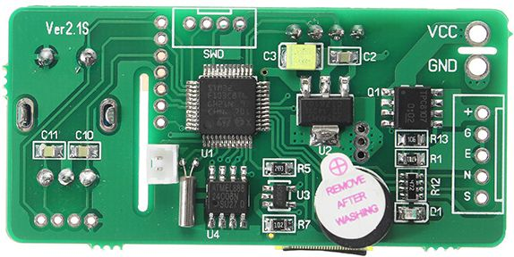
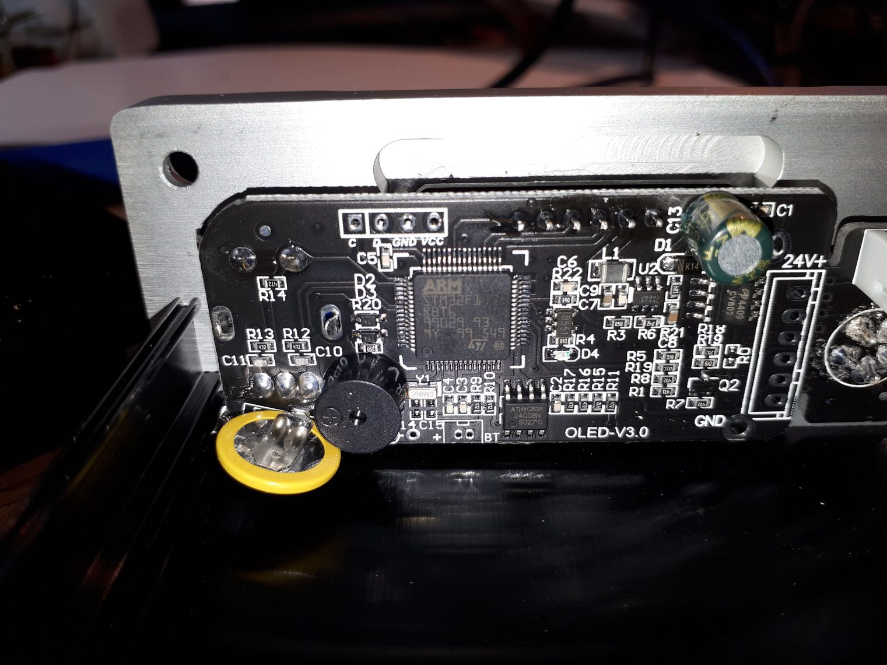
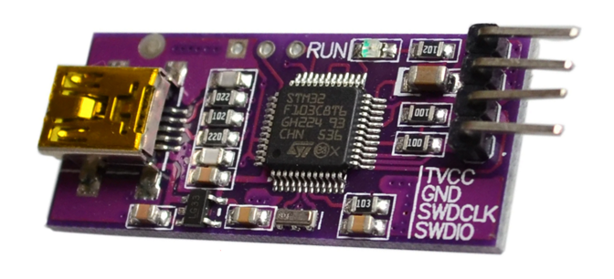
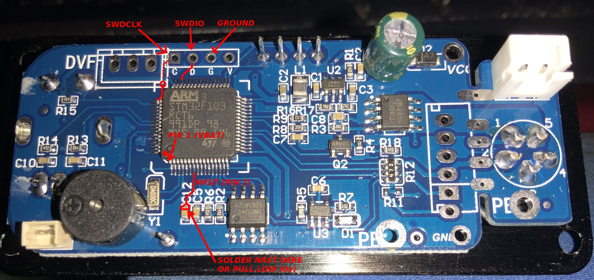
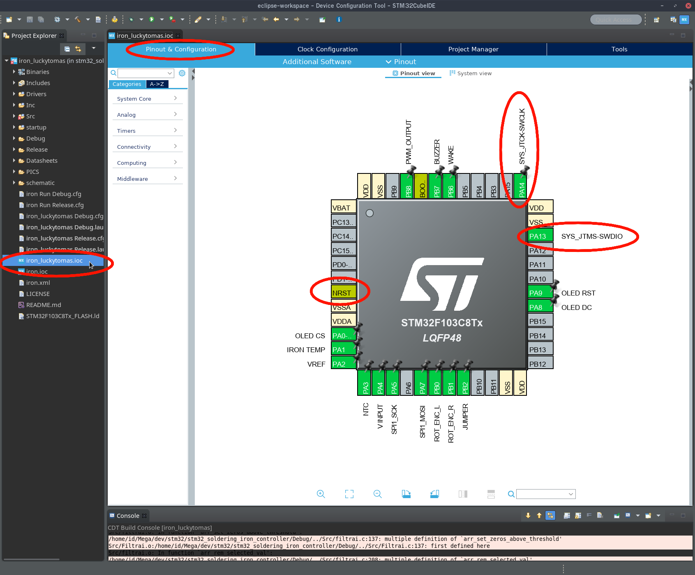
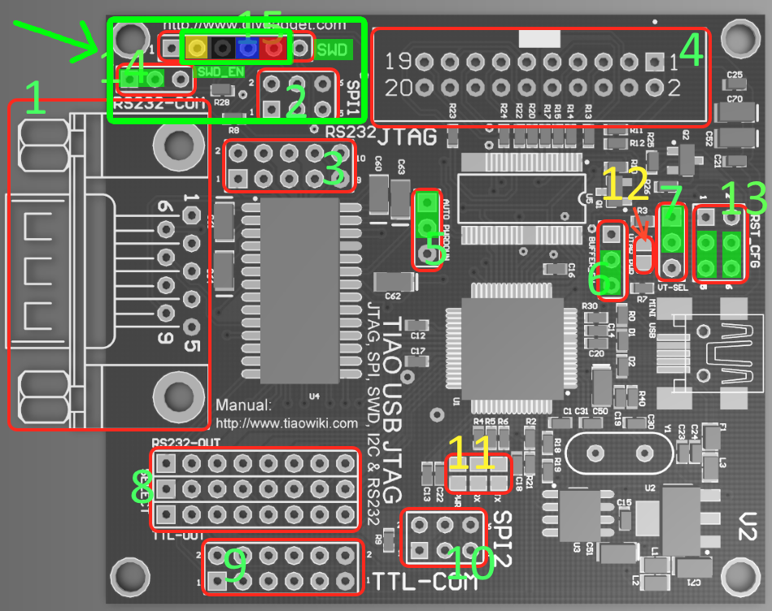
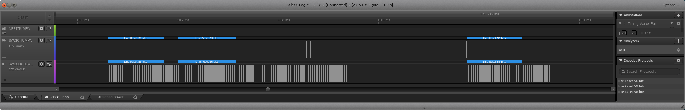
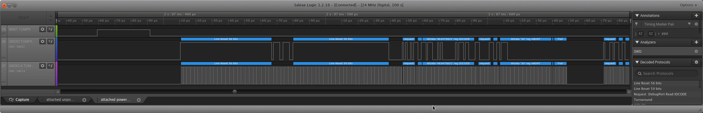

# stm32_soldering_iron_controller

<!-- MarkdownTOC -->

* [Compatibility](#compatibility)
    * [LQFP-32 version \(of 'v2.1S' PCB\)](#lqfp-32-version-of-v21s-pcb)
    * [\[Experimental\] LQFP-64 version \(of 'v2.1S' PCB\)](#experimental-lqfp-64-version-of-v21s-pcb)
    * [\[Unknown\] Complete Station 'V3.1S' with OLED-V3.0' PCB](#unknown-complete-station-v31s-with-oled-v30-pcb)
    * [**WARNING!!** Before flashing](#warning-before-flashing)
* [Status](#status)
    * [Working](#working)
    * [Todo](#todo)
* [Install Dependancies](#install-dependancies)
    * [Install STM32CubeIDE](#install-stm32cubeide)
        * [About STM32CubeIDE](#about-stm32cubeide)
        * [About STM32CubeMX](#about-stm32cubemx)
    * [Install OpenOCD](#install-openocd)
* [Building / Compiling This Firmware](#building--compiling-this-firmware)
    * [Building in STM32CubeIDE](#building-in-stm32cubeide)
    * [Debugging within STM32CubeIDE](#debugging-within-stm32cubeide)
* [Connecting Hardware](#connecting-hardware)
    * [SWD Programmers / Debuggers](#swd-programmers--debuggers)
    * [STM32 OLED Controller PCB \(Target device\)](#stm32-oled-controller-pcb-target-device)
        * [Finding the target pin assignments in STM32Cube**MX** Tool](#finding-the-target-pin-assignments-in-stm32cubemx-tool)
* [Connecting a hardware Debugger](#connecting-a-hardware-debugger)
        * [TIAO TUMPA v2 Jumper settings](#tiao-tumpa-v2-jumper-settings)
    * [Connecting a Logic Analyzer](#connecting-a-logic-analyzer)
* [Connecting over SWD](#connecting-over-swd)
    * [With OpenOCD](#with-openocd)
        * [With a TIAO TUMPA v2 hardware debugger](#with-a-tiao-tumpa-v2-hardware-debugger)
        * [Failed Connection](#failed-connection)
        * [Successful Connection](#successful-connection)
* [OpenOCD](#openocd)
    * [Connecting over STM32CubeIDE](#connecting-over-stm32cubeide)
    * [Connecting over Telnet](#connecting-over-telnet)
        * [Flash Info](#flash-info)
        * [Reset Halt](#reset-halt)
* [Backup the Original Firmware \(OFW\)](#backup-the-original-firmware-ofw)
* [Flash the new firmware](#flash-the-new-firmware)

<!-- /MarkdownTOC -->

Custom firmware for the chinese kseger soldering iron controller

Original version by PTDreamer.

Check http://www.ptdreamer.com/chinese-stm32-oled-soldering-controller-reverse-engineer-custom-firmware/ for more information

<a id="compatibility"></a>
## Compatibility

Currently only the LQFP-32 version (of 'v2.1S' PCB) is known to be supported by this branch of the PTDreamer's code. Other PCBs ***might*** work, to a greater or lesser extent. We do not know enough about them yet.

**BE SURE** to backup your OFW. Or make a best efforts to identify your official KSGER OFW Firmware from those available to download. There is a section later on about that.

<a id="lqfp-32-version-of-v21s-pcb"></a>
### LQFP-32 version (of 'v2.1S' PCB)

This is a fork of ptdreamer's firmware, adapted for a `v2.1s` PCB revision. These are all slightly different STM32 soldering controller.

Unfortunately there appear to be multiple so-called 'v2.1S' hardware revisions floating around out there. Generally speaking they both use some type of an STM32**F103** MCU.

One of the PCBs uses a **32 pin* LQFP package. This PCB is pictured here and is in the [schematics folder](schematic/Ver2.1S) under [LQFP-32 sub folder](schematic/Ver2.1S/LQFP-32). **This is the original version of the hardware is what is supposed to be supported by this source code**. You should be sure to check very carefully (and in detail) for verifying your board.



<a id="experimental-lqfp-64-version-of-v21s-pcb"></a>
### [Experimental] LQFP-64 version (of 'v2.1S' PCB)

There is also another 2nd different PCB version also printed and claiming to be `v2.1s`. It has `v2.1s` printed in a different place on it's silk screen. Not the same PCB. Clearly it's layout and connections are not quite the same.

The main visible difference are the large green capacitor and the much bigger processor package with 64 pins instead of 32. It's still an STM32**F103** MCU though.

It's current status is considered to be **Experimental**. 1 user has reported to have flashed it and says that 'it also works'. This other PCB. However this is yet to be confirmed and verified. For example maybe some aspects do not work as intended etc. So try at your own risk!


<a id="unknown-complete-station-v31s-with-oled-v30-pcb"></a>
### [Unknown] Complete Station 'V3.1S' with OLED-V3.0' PCB

Now this is where it gets more complicated. Because there are also some complete (pre assembled) Soldering Iron Controller being sold. Which themselves contain various different PCB versions and revisions.

One particularly close one was found by others here:

https://www.eevblog.com/forum/reviews/ksger-t12-stm32-v3-1s-soldering-station/msg2873548/#msg2873548


And a photo taken of the back of the controller PCB. As you can see here:




The PCB looks very similar to our above 2nd version of the `V2.1S` with a larger 64-LQFP MCU. And also the Green capacitor on it. However looking more closely there seem to be other suble changes in the layout with groupls of the smaller SMD components.

So clearly it's not quite the same thing. However it may be an iteration or revised (newer) version of our 'Experimental status' 2nd PCB.

However 0 people are known to have currently tested this firmware onto that version of the PCB. So it's current support status is considered to be **Unknown**. Until somebody comes along and can confirm that it works.

However we may otherwise be able to get some schematics for this version and compare it to the other previous one.

<a id="warning-before-flashing"></a>
### **WARNING!!** Before flashing

We support is considered experimental and we do not recommend flashing over your existing official firmware (OFW) without first of all trying to determine and verify that you can first flash it back to some official KSGER firmware for these "T12 OLED" soldering stations. That is actually the **more difficult step** to perform successfully. Because there are many different versions of the official KSGER firmware for many different hardware PCB revisions. And it may not be clear which OFW you require in order to flash back your board to stock.

To help you do that (backup the OFW, which is copy protected)... there is a further seperate section of resource links included later on in this README file.

<a id="status"></a>
## Status

**WARNING:** Tip temperature measurement is still unreliable, this firmware might heat up your iron far above the temperature on display. Use with caution and at own risk!

<a id="working"></a>
### Working

* OLED Display
* Rotary Encoder
* Buzzer
* Wake switch
* Supply voltage sensor
* Ambient temperature sensor (might need calibration)
* Tip temperature read out (might also need calibration)
* T12 PWM Control (might burn your tip)

<a id="todo"></a>
### Todo

* I2C eeprom


<a id="install-dependancies"></a>
## Install Dependancies

These instructions were tested on **Ubuntu 19.10 Linux**. You can do on other platforms which are also available for these software. Check the same links here below. However some of your installation steps may differ.

<a id="install-stm32cubeide"></a>
### Install STM32CubeIDE

Download page:

https://my.st.com/content/my_st_com/en/products/development-tools/software-development-tools/stm32-software-development-tools/stm32-ides/stm32cubeide.html


* Unzip the installer

```sh
mkdir stm32cubeide_1.2.0_setup
cd stm32cubeide_1.2.0_setup
unzip ../en.st-stm32cubeide_1.2.0_5034_20200108_0926_amd64.deb_bundle.sh.zip
```

* Launch the graphical installer

```sh
sudo ./st-stm32cubeide_1.2.0_5034_20200108_0926_amd64.deb_bundle.sh
```

After installing STM32Cube**IDE**, go ahead and launch the program. And check for updates. If a newer version is found then download and install / update using the built in updater. The program will relaunch itself.

<a id="about-stm32cubeide"></a>
#### About STM32CubeIDE

This is a skinned Eclipse IDE. Customized for working on projects for STM32 by ST Microelectronics. Those customizations will include other package dependancies, libraries, plugins, etc. There is a hidden Eclipse `.project` file in the codes root folder. From which the code can be opened in this IDE tool, for editing. And then also compiled / built into a `.BIN` or `.ELF` file for flashing. There may also be tools for debugging etc.

**Note:** When you first launch this program it does not show the main workspace. Where the open projects get displayed to. You have to manually click an icon in the top left corner, in order to get to that view.

STM32Cube**IDE** also now includes within it a related tool named STM32Cube**MX**. Which is used for pin assignments, and configuring the clock generator / PLLs and other interfaces, debugging modes, etc.

<a id="about-stm32cubemx"></a>
#### About STM32CubeMX

This used to be a seperate tool. And is in fact also still available for download standalone. However now MX has been rolled into the IDE. The MX tool can be opened by clicking on the `.ioc` file in the project's root folder. It will then open in a new tab within the same Eclipse IDE. It lets you setup the GPIO pins, the ADCs and other onboard functions as to what specific mode(s) they are configured and deployed as. For example if you enable a UART you might have to disable an SPI port. etc. You can also configure the clock generator and the PLLs.

Changes should be reflected / updated into the project's C source code files. With stub functions, templated `main()` loop and the setup of other applicable code structures etc. Which then in turn can be manually edited and tweaked.

<a id="install-openocd"></a>
### Install OpenOCD

[**OpenOCD**](http://openocd.org/doc/html/index.html#SEC_Contents) is a linux tool for embedded programming and debugging. You will also need to hook up some connections with an appropriate interface / adapter to your PC.

These instructions were tested to work on Ubuntu Linux 19.10. For other platforms you will need to perform other steps. Which isnt documented here.

```sh
# remove the official package, if already installed
sudo apt remove openocd

# download latest official version with git
git clone https://git.code.sf.net/p/openocd/code openocd
cd openocd

# # you can use master branch, or checkout the most recent release
# git branch -r | grep -i "origin/v" | sort | tail -1
# git checkout origin/v0.6.1

./bootstrap

# see the list of supported compiler options
./configure --help

# # for programmers using the FT2232 chip
# sudo apt install -y libftdi-dev

# build
# ./configure --enable-ft2232_libftdi --disable-werror
./configure
make

# install into /usr/local
sudo make install
```

<a id="building--compiling-this-firmware"></a>
## Building / Compiling This Firmware

<a id="building-in-stm32cubeide"></a>
### Building in STM32CubeIDE

After `git clone`ing or downloading this repository to a local folder, go ahead and open that folder up in STM32Cube**IDE**. Under **File --> Open Project** in the menu.

After loading the project up you will need to navigate to your main Eclipse **Workspace**, which contains the list of all your projects. Then left click on the **Project* that you have just opened. In order to highlight it.

From here you can either expand the top level project folder and double click on the **`.IOC`** file to open up STM32Cube**MX** sub window. To see pin assignments etc.

Or you can right select the top level project folder, and navigate to **Project --> Properties**, to select the active build target as either **Debug** or **Release**.

After selecting the Build Target, you can compile for that target. And a binary `.BIN` and `.ELF` should be built. From within the STM32 IDE.

<a id="debugging-within-stm32cubeide"></a>
### Debugging within STM32CubeIDE

You can also select **Run --> Debug Configurations...** once you have selected the **Debug** build target. And from here select which **Debugger** to connect to. I recommend **OpenOCD** on `localhost` port `3333`.

Aside from OpenOCD there are 2 other supported SWD compatible debuggers available to choose from:

* [J-Link](https://www.segger.com/downloads/jlink/)
* [ST-Link](https://www.st.com/en/development-tools/st-link-v2.html#tools-software).

In fact a version of ST-Link may already be embedded into STM32Cube**IDE** itself. If you have a officially compatible device. There is also an [Open source version of ST-Link](https://github.com/stlink-org/stlink), which IDK if it's feature complete, and may still be developing it's set of supported features.

Those are available seperately and not tested in this guide. The debugger we cover is OpenOCD.

<a id="connecting-hardware"></a>
## Connecting Hardware

<a id="swd-programmers--debuggers"></a>
### SWD Programmers / Debuggers

The debugger I have here is the [TIAO TUMPA v2](https://www.tiaowiki.com/w/TIAO_USB_Multi_Protocol_Adapter_User%27s_Manual). Which includes an SWD header and is supported by OpenOCD.

If you cannot get that device then there are a variety cheap J-Link clones / compatible devices available. For example [this one](https://www.aliexpress.com/item/32743219240.html):



<a id="stm32-oled-controller-pcb-target-device"></a>
### STM32 OLED Controller PCB (Target device)

***Example:*** Here is the connections for the 64 LQFP version of the MCU



Most of the other PCB versions tend to have a line of 4 pinx marked up as **SWD** or **C D G V**  on the silkskreen, this is the header for the SWD Debugging Interface. That we wish to connect through.

<a id="finding-the-target-pin-assignments-in-stm32cubemx-tool"></a>
#### Finding the target pin assignments in STM32Cube**MX** Tool

These STM32 microprocessors have partially reassignable pin configurations. However if you open the `.ioc` file in the STM32Cube**IDE**. Then it will open up the **MX** Tool in a sub window.



<a id="connecting-a-hardware-debugger"></a>
## Connecting a hardware Debugger

There are different SWD debuggers / programmers available. Whichever device you have, I also recommend connecting up a **logic analyzer** if you have one. In order to confirm that the device is being activated and is connecting as expected.


You will need to connect to the following pins on your debugger:

* SWDCLK - 1Mhz clock signal that the debugger generates. Clock is only generated whilst the device is actually trying to connect over SWD. If the operation times out then it will appear only briefly.

* SWDIO - This is the single bi-directional data line. In this sense, it is a 1 wire interface like I2C. Devices take turns to put data over the bus. In sync with the 1Mhz default clock speed.

* GND - The 2 devices should ideally be voltage referenced to each other via  acommon Ground. Barring any other grounding constraints. In which case you are on your own.

* NRST (optional) - This is the RESET pin labelled `NRST`, on the STM32F103 MCU. This allows your debugger / programmer to send a reset signal to the device to force it to reboot. Just before starting to talk to it over SWD. Alternatively you can temporarily trigger NRST manually yourself by shorting it to ground with a pair of metal tweezers.

By dragging NRST LOW (0v) then it puts the MCU in a reset state. Which then stops the processor loading up the current firmware on it's integrated flash. And then allows you to bypass any ways the current firmware my attemt to ignore the SWD debugging interface. This NRST reset method is known to work with all STM32 MCUs. Since it gives no time for the firmware a chance to load.

There is also a `+3.3v` output on your programmer device. To bus-power the target devie via the programmer. Do not connect that line. Leave it open because usually the programmer is only able to source enough extra power for just the STM32 MCU itself. And not all the other stuff connected to the +3v3 line on the target device.

Instead you must independantly power the taget device (the STM32 OLED Controller PCB) by connecting it to a +24v DC power source. Then the chip will get enough power on it's +3v3 rail to respond to the SWD queries coming from the debugger device. Which is GND referenced.

<a id="tiao-tumpa-v2-jumper-settings"></a>
#### TIAO TUMPA v2 Jumper settings

The following pin settings were selected on the TUMPA v2 programmer. They are **COLOR** coded with the diagram below:

* [SWD_EN](https://www.tiaowiki.com/w/TIAO_USB_Multi_Protocol_Adapter_User%27s_Manual#SWD_Enable_Jumper)
   * SWD Enabled = ON (**GREEN**)

* [SWD Header](https://www.tiaowiki.com/w/TIAO_USB_Multi_Protocol_Adapter_User%27s_Manual#SWD_Header) (All except `+v3.3` and `SWO`)
  * SWDCLK --> 'C' on stm32 PCB (**YELLOW**)
  * GND --> 'G' on stm32 PCB (**BLACK**)
  * SWDIO --> 'D' on stm32 PCB (**BLUE**)
  * NRST --> to 'NRST' on stm32 MCU (**RED**)

*On my TUMPA:*



<a id="connecting-a-logic-analyzer"></a>
### Connecting a Logic Analyzer

If you have a logic analyzer then also connect it onto the following lines:

* GND --> GND
* SWDCLK --> Connect SWD Clock to a Data channel on the logic analyzer. *Do not connect to the logic analyzer's clock!*
* SWDIO --> Connect SWD Data line to a Data channel on the logic analyzer
* NRST --> Connect the MCU Reset signal to a Data channel on the logic analyzer

**Here are some example traces from the logic analyzer:**

When communication fails because the target device was not powered:



When communication is successful, because the target device is correctly receiving power:



<a id="connecting-over-swd"></a>
## Connecting over SWD

<a id="with-openocd"></a>
### With OpenOCD

<a id="with-a-tiao-tumpa-v2-hardware-debugger"></a>
#### With a TIAO TUMPA v2 hardware debugger

These `openocd` commands are **specially only for the TUMPA v2** programmer device. If you use a different SWD programmer then it is ***highly likely*** that you will need to run `openocd` with a very different set of configuration options than is being shown here:

If you did not install `openocd` tool system wide. You can run the compiled binary directly from it's source folder with a command like this:

```sh
sudo src/openocd -d4 -s tcl -f interface/ftdi/tumpa.cfg -f interface/ftdi/swd-resistor-hack.cfg -c "transport select swd" -f target/stm32f1x.cfg -c "reset_config srst_only connect_assert_srst"
```

* `-d4` flag - this is an optional extra logging level
* `-s tcl` - this tells `openocd` to look under the `tcl` folder for the latest config files
* `-f interface/ftdi/tumpa.cfg -f interface/ftdi/swd-resistor-hack.cfg` - these flags specific for my TUMPA v2 programmer device
* `-c "transport select swd"` - tells `openocd` to use the `SWD` transport protocol
* `-f target/stm32f1x.cfg` - tells `openocd` to target the `STM32F1xx` family of processors. Ours is an `F103`.
* -c "reset_config srst_only connect_assert_srst" - I believe this flag tells `openocd` to send a RESET command to the programmer device. Just before attempting to start SWD link. However this flag might not work with your specific programmer. For example if it isn't a TUMPA v2 (not sure).

<a id="failed-connection"></a>
#### Failed Connection

If there is a problem communicating. Then most often that will manifest itself as 'no response from the target device'. Here is an example of that response from `openocd` program. I simply turned off the `+24v` supply. So it could not get power.

```sh
θ66° [id:~/.dev/stm32/openocd] master(+0/-0) 130 ± sudo src/openocd -s tcl -f interface/ftdi/tumpa.cfg -f interface/ftdi/swd-resistor-hack.cfg -c "transport select swd" -f target/stm32f1x.cfg -c "reset_config srst_only connect_assert_srst"
Open On-Chip Debugger 0.10.0+dev-01266-gd8ac0086-dirty (2020-05-27-14:47)
Licensed under GNU GPL v2
For bug reports, read
    http://openocd.org/doc/doxygen/bugs.html
none separate

Info : FTDI SWD mode enabled
Warn : Transport "swd" was already selected
swd
srst_only separate srst_nogate srst_push_pull connect_assert_srst

Info : Listening on port 6666 for tcl connections
Info : Listening on port 4444 for telnet connections
Info : clock speed 1000 kHz


θ64° [id:~/.dev/stm32/openocd] master(+0/-0) 1 ± 
```

There is no error message, and `openocd` just exits with a return code of `-1`. However if we append the `-d3` flag. For debug logging level `3`. Then we see an `error code -4` message:

```sh
Debug: 267 5 arm_dap.c:106 dap_init_all(): Initializing all DAPs ...
Debug: 268 5 core.c:636 adapter_system_reset(): SRST line asserted
Debug: 269 5 ftdi.c:1211 ftdi_swd_switch_seq(): JTAG-to-SWD
Debug: 270 5 command.c:626 run_command(): Command 'dap init' failed with error code -4
User : 271 5 command.c:692 command_run_line(): 
Debug: 272 5 command.c:626 run_command(): Command 'init' failed with error code -4
User : 273 5 command.c:692 command_run_line(): 
Debug: 274 5 target.c:1978 target_free_all_working_areas_restore(): freeing all working areas
Debug: 275 5 ftdi.c:1216 ftdi_swd_switch_seq(): SWD-to-JTAG
θ69° [id:~/.dev/stm32/openocd] master(+0/-0) 1 ± 

```

And finally with `-d4` we see:

```sh
Debug: 335 5 ftdi.c:1072 ftdi_swd_run_queue(): Executing 2 queued transactions
Debug: 336 5 mpsse.c:500 mpsse_clock_data():  8 bits
Debug: 337 5 mpsse.c:458 buffer_write_byte(): 19
Debug: 338 5 mpsse.c:458 buffer_write_byte(): 00
Debug: 339 5 mpsse.c:458 buffer_write_byte(): 00
Debug: 340 5 mpsse.c:458 buffer_write_byte(): 00
Debug: 341 5 mpsse.c:857 mpsse_flush(): write 49+1, read 6
Debug: 342 5 mpsse.c:458 buffer_write_byte(): 87
Debug: 343 5 mpsse.c:832 write_cb(): transferred 50 of 50
Debug: 344 5 mpsse.c:834 write_cb():  19 10 00 ff ff ff ff ff ff ff 9e e7 ff ff ff ff ff ff ff 00 19 00 00 a5 29 03 00 2b 05 19 00 00
Debug: 345 5 mpsse.c:834 write_cb():  81 2b 04 19 03 00 1e 00 00 00 1b 00 00 19 00 00 00 87
Debug: 346 5 mpsse.c:794 read_cb():  32 60 ff ff ff ff ff ff
Debug: 347 5 mpsse.c:817 read_cb(): raw chunk 8, transferred 6 of 6
Debug: 348 5 ftdi.c:1098 ftdi_swd_run_queue(): JUNK DP read reg 0 = ffffffff
Debug: 349 5 command.c:626 run_command(): Command 'dap init' failed with error code -4
User : 350 6 command.c:692 command_run_line(): 
Debug: 351 6 command.c:626 run_command(): Command 'init' failed with error code -4
```

This all simply means that OpenOCD tried to establish a connection over SWD protocol. But there was no response from the other end. There was some type of a problem with the communication to the target device.

Failed connection is typically be one of these things:

* Bad wiring of the SWD connection lines. Check them with multimeter.
* The target device is not being powered correctly. Or well enough through it's own independant power supply. Does it have a strong `+3v3` on it's power rails?
* Your hardware programmer device is not configured into the correct communications mode for SWD (if it has jumpers)
* `openocd` program not given appropriate `root` or `udev` permissions on the operating system, to access the USB interface of the USB programmer device. Check manual and double check.
* Target device is somehow broken. For example has a bad solder joint to pins, or GPIO is burnt out by ESD shock. 

<a id="successful-connection"></a>
#### Successful Connection

If you have established a successful connection, you should see in terminal some output like this:

```sh
θ63° [id:~/.dev/stm32/openocd] master(+0/-0) 130 ± sudo src/openocd -s tcl -f interface/ftdi/tumpa.cfg -f interface/ftdi/swd-resistor-hack.cfg -c "transport select swd" -f target/stm32f1x.cfg -c "reset_config srst_only connect_assert_srst"
Open On-Chip Debugger 0.10.0+dev-01266-gd8ac0086-dirty (2020-05-27-14:47)
Licensed under GNU GPL v2
For bug reports, read
    http://openocd.org/doc/doxygen/bugs.html
none separate

Info : FTDI SWD mode enabled
Warn : Transport "swd" was already selected
swd
srst_only separate srst_nogate srst_push_pull connect_assert_srst

Info : Listening on port 6666 for tcl connections
Info : Listening on port 4444 for telnet connections
Info : clock speed 1000 kHz
Info : SWD DPIDR 0x1ba01477
Info : stm32f1x.cpu: hardware has 6 breakpoints, 4 watchpoints
Info : stm32f1x.cpu: external reset detected
Info : starting gdb server for stm32f1x.cpu on 3333
Info : Listening on port 3333 for gdb connections

```

<a id="openocd"></a>
## OpenOCD

<a id="connecting-over-stm32cubeide"></a>
### Connecting over STM32CubeIDE

Once you have successfully established a connection over SWD protocol with the `openocd` prigram. Then OpenOCD should stay open and running in a server. It should say:

```sh
Info : starting gdb server for stm32f1x.cpu on 3333
Info : Listening on port 3333 for gdb connections
```

This then lets you to back to STM32Cube**IDE** and input `localhost` port `3333` into the Debugger settings under **Run --> Debugger Configuration...**. And then you can establish a connection to the hardware. And use this link for hardware debugging etc.

<a id="connecting-over-telnet"></a>
### Connecting over Telnet

If OpenOCD has establisted a successful connection over SWD. Then you may also connect over `telnet`. But using the following command. This will let you run some very helpful commands through `openocd` interactively. For example to probe the device information. To backup the firmware. Or to flash a new firmware etc.

Once you login over telnet type `init`. To run the init command. This will ensure you are ready to run other commands.

```sh
64° [id:~/.dev/stm32/openocd] master(+0/-0) ± telnet 127.0.0.1 4444
Trying 127.0.0.1...
Connected to 127.0.0.1.
Escape character is '^]'.
Open On-Chip Debugger
> init
> 
```

Now you can run any commands in the openocd documentation. Here are some examples:

<a id="flash-info"></a>
#### Flash Info

The command `flash info 0`, when run over telnet port `4444`. And after `init`. Will show a memory map of the flash area embedded on the STM32 MCU controller chip.

As you can see here (below). The Original Firmware is comprised of 32 chunks each of 4kb size. And all of the appear to be `protected`. This is some form of DRM protection which prevents us from dumping or examining the existing firmware.

```sh
θ64° [id:~/.dev/stm32/openocd] master(+0/-0) ± telnet 127.0.0.1 4444
Trying 127.0.0.1...
Connected to 127.0.0.1.
Escape character is '^]'.
Open On-Chip Debugger
> init
> flash info 0
device id = 0x10036414
STM32 flash size failed, probe inaccurate - assuming 512k flash
flash size = 512kbytes
#0 : stm32f1x at 0x08000000, size 0x00080000, buswidth 0, chipwidth 0
    #  0: 0x00000000 (0x1000 4kB) protected
    #  1: 0x00001000 (0x1000 4kB) protected
    #  2: 0x00002000 (0x1000 4kB) protected
    #  3: 0x00003000 (0x1000 4kB) protected
    #  4: 0x00004000 (0x1000 4kB) protected
    #  5: 0x00005000 (0x1000 4kB) protected
    #  6: 0x00006000 (0x1000 4kB) protected
    #  7: 0x00007000 (0x1000 4kB) protected
    #  8: 0x00008000 (0x1000 4kB) protected
    #  9: 0x00009000 (0x1000 4kB) protected
    # 10: 0x0000a000 (0x1000 4kB) protected
    # 11: 0x0000b000 (0x1000 4kB) protected
    # 12: 0x0000c000 (0x1000 4kB) protected
    # 13: 0x0000d000 (0x1000 4kB) protected
    # 14: 0x0000e000 (0x1000 4kB) protected
    # 15: 0x0000f000 (0x1000 4kB) protected
    # 16: 0x00010000 (0x1000 4kB) protected
    # 17: 0x00011000 (0x1000 4kB) protected
    # 18: 0x00012000 (0x1000 4kB) protected
    # 19: 0x00013000 (0x1000 4kB) protected
    # 20: 0x00014000 (0x1000 4kB) protected
    # 21: 0x00015000 (0x1000 4kB) protected
    # 22: 0x00016000 (0x1000 4kB) protected
    # 23: 0x00017000 (0x1000 4kB) protected
    # 24: 0x00018000 (0x1000 4kB) protected
    # 25: 0x00019000 (0x1000 4kB) protected
    # 26: 0x0001a000 (0x1000 4kB) protected
    # 27: 0x0001b000 (0x1000 4kB) protected
    # 28: 0x0001c000 (0x1000 4kB) protected
    # 29: 0x0001d000 (0x1000 4kB) protected
    # 30: 0x0001e000 (0x1000 4kB) protected
    # 31: 0x0001f000 (0x61000 388kB) protected
STM32F10x (High Density) - Rev: Y

> 
```

However in the next sections, we will try to [follow other online guides](https://blog.zapb.de/stm32f1-exceptional-failure/) to try to better identify which official firmware this is. So that we can have a backup to revert to should our Open Source firmware turn out to be unsuitable for our specific revision of the STM32 pcb.


<a id="reset-halt"></a>
#### Reset Halt

Sending a `reset halt` command to the STM32 over SWD should look something like this:

```sh
> reset halt
target halted due to debug-request, current mode: Thread 
xPSR: 0x01000000 pc: 0x08000100 msp: 0x200037c8
> 
```

If you see some valid address returned by the program counter `pc: 0x08000xxx` that is not `0x00`. This is the firmware program's memory address to jump to for the current exception trap / context. Since we issued a `halt` command an exception gets generated and the program is taken to it's current exception handler.

Then it would appear that it's possible to read flash data **indirectly over the ICode bus**. In order to circumvent the regular data bus ("DCode bus"). That SWD has it's traditional direct access to. This is explained in the [guide here](https://blog.zapb.de/stm32f1-exceptional-failure/)

<a id="backup-the-original-firmware-ofw"></a>
## Backup the Original Firmware (OFW)

***T.B.D.***

The original firmware (OFW) flashed onto the device may be copy protected. As we saw returned by the command `flash info 0`, which we issued in the interactive session. After connecting to the OpenOCD background task through `telnet localhost 4444`.

So the method may to be to use *exception handling via the ICode Bus** to indirectly probe 'most of the firmware' on the flash area. And obtain a partial image. From that it is then possible to compare the region of that firmware to the same corresponding address range on a varietys of Official Firmware images (OFW). To determine which firmware version is the correct one correspoinding to your specific board / PCB revision.

<a id="flash-the-new-firmware"></a>
## Flash the new firmware

***T.B.D.***

We want to backup the OFW first. Or know how to get back to it.


